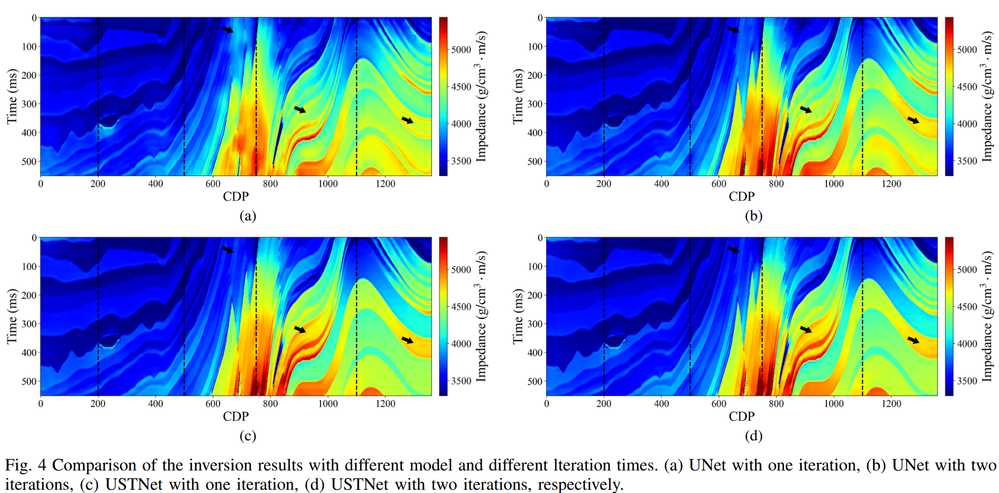

## About The Project

Seismic impedance inversion is essential for subsurface exploration, facilitating precise lithological interpretation by reconstructing subsurface impedance. Although recent deep learning-based methods have advanced this field, many rely on direct mapping from observation to model space, which increases solution uncertainty due to the presence of a large null space, impacting inversion accuracy. To address this issue, we propose an iterative method that operates within the model space, applying progressive gradient correction to incrementally refine the current model towards a physically plausible solution, effectively reducing non-uniqueness and improving inversion robustness compared to single-step updates. The effectiveness of this iterative framework is further strengthened by a semisupervised learning approach, which critically depends on both the network architecture and the design of the loss function. While most DL methods use convolutional architectures, their localized nature limits the capture of long-range dependencies critical for seismic inversion. To overcome this, we introduce USTNet, a hybrid UNet-Swin Transformer architecture that captures multi-scale features, improving inversion precision. To further ensure consistency with subsurface structure, structural priors are incorporated into the loss function, reinforcing spatial coherence. Experiments on synthetic and field data confirm that the proposed method significantly outperforms conventional and several state-of-the-art deep learning approaches in accuracy.

## Some Results

